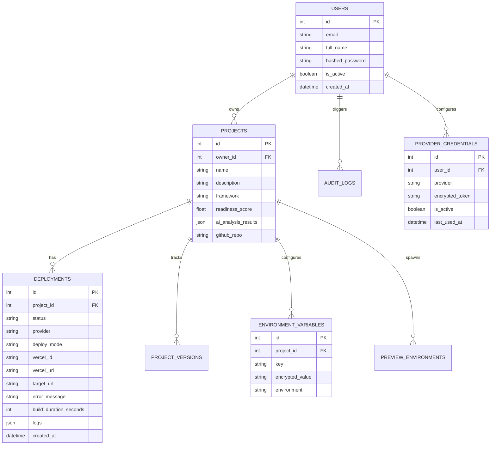

# DeployMind AI Platform Architecture

DeployMind AI is an enterprise-grade AI-powered deployment orchestration platform. This document outlines the system architecture, database schema, and core API endpoints.

## 1. System Architecture

The platform utilizes a modern, event-driven stack to provide seamless deployments, real-time logging, and deep AI integrations.

```mermaid
graph TD
    Client[Client Browser (React)] -->|REST API & WebSockets| API[FastAPI Backend]
    
    subgraph "Frontend Layer"
        UI[Vite + React UI]
        State[Zustand State Management]
        Charts[Recharts Analytics & AI Insights]
    end
    
    subgraph "Backend Services"
        API[FastAPI Routers]
        Auth[JWT Authentication]
        WS[WebSocket Manager]
        Celery[Celery Task Orchestration]
    end
    
    subgraph "Data & Messaging Layer"
        Supabase[(Supabase PostgreSQL)]
        Redis[(Redis Message Broker)]
    end
    
    subgraph "External Integrations"
        Groq[Groq AI Inference Engine]
        Cloud[Cloud Providers API]
        GitHub[GitHub API]
    end
    
    UI <--> API
    API <--> Supabase
    API --> Redis
    Redis <--> Celery
    Celery --> WS
    Celery <--> Groq
    API <--> Groq
    Celery <--> Cloud
    API <--> Cloud
    Celery <--> GitHub
```

### Core Components
- **Frontend**: Vite + React, styled with vanilla CSS + Tailwind utils, animated with Framer Motion.
- **Backend API**: FastAPI (Python) running on Uvicorn, handling REST endpoints and real-time WebSockets.
- **Task Queue**: Celery backed by Redis for asynchronous orchestration (AI scanning, deployments).
- **Database**: Supabase PostgreSQL for persistent state, models managed via SQLAlchemy ORM.

---

## 2. Database Schema

The database uses a relational model designed to track projects, deployment histories, environment variables, and auditing.



---

## 3. Core API Documentation

### Authentication (`/api/users`)
- `POST /login` - Authenticate and retrieve JWT payload.
- `POST /register` - Register a new user account.
- `POST /refresh` - Refresh access tokens.

### Projects (`/api/projects`)
- `GET /` - List all projects owned by the user.
- `POST /upload` - Securely upload a project ZIP file, triggering framework detection and AI scanning.
- `POST /{id}/fix` - Trigger the "Fix My Project" AI sequence.
- `GET /{id}/env-vars` - Fetch decrypted environment variables.

### Deployments (`/api/deployments`)
- `GET /` - List deployments globally or filter by project.
- `POST /` - Initiate a deployment to Vercel/Netlify.
- `POST /{id}/rollback` - Revert a deployment to a previous healthy state.
- `POST /{id}/retry` - Retry a failed deployment sequence.
- `POST /{id}/diagnostics` - Trigger AI analysis on deployment failure logs.

### Analytics & Audit (`/api/analytics`, `/api/audit`)
- `GET /analytics/` - Retrieve 7-day deployment trends, success rates, and project telemetry.
- `GET /audit/` - Retrieve paginated security and system audit logs.

### WebSockets (`/ws`)
- `ws://.../ws/logs/{deployment_id}` - Stream real-time standard output and diagnostic logs during the deployment process.
